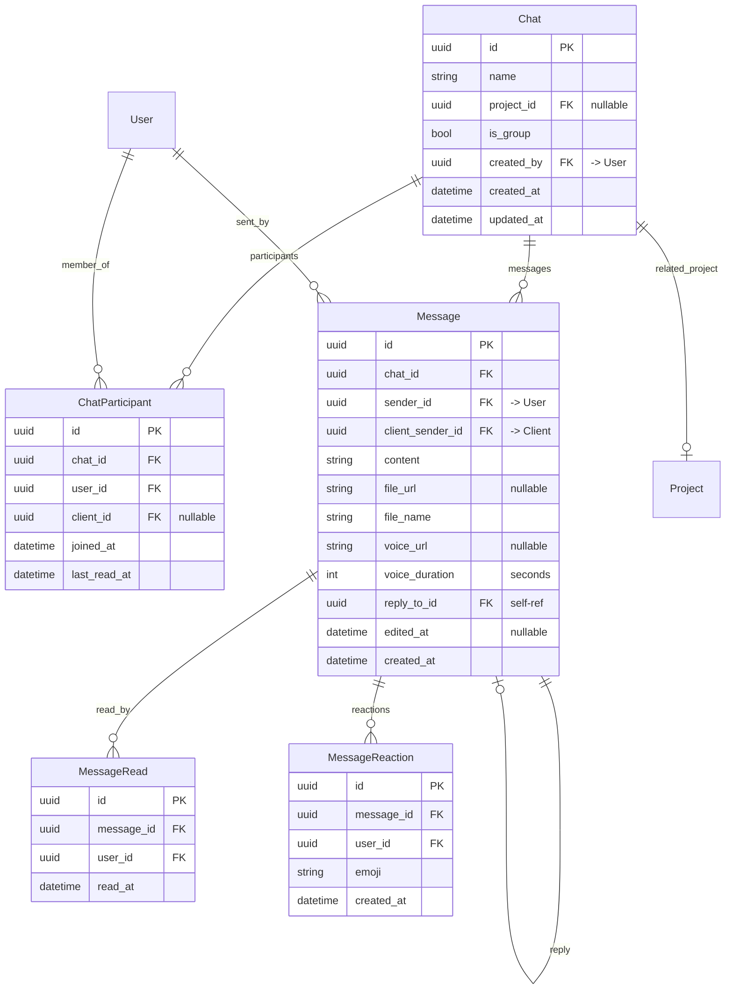
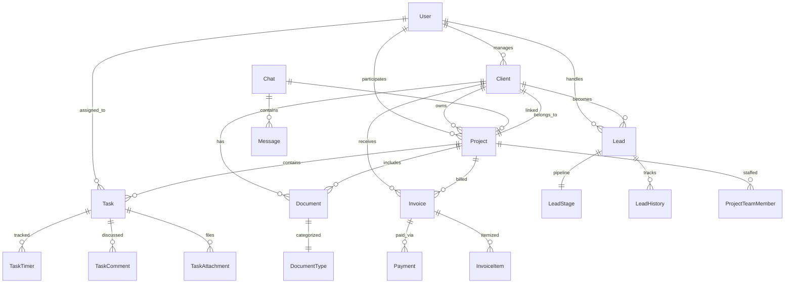

# DEO STUDIO CRM — ERD Диаграмма базы данных

## 📊 Полная схема данных

### Легенда
```
PK  = Primary Key
FK  = Foreign Key
UQ  = Unique
NN  = Not Null
A   = Auto Increment
I   = Indexed
```

---

## 1. Модуль пользователей и ролей (Accounts)

```mermaid
erDiagram
    User {
        uuid id PK "UUID"
        string email UQ, NN
        string password_hash NN
        string first_name NN
        string last_name NN
        string phone
        string avatar_url
        bool is_active "default: true"
        bool is_2fa_enabled "default: false"
        string 2fa_secret
        datetime last_login
        datetime created_at "auto"
        datetime updated_at "auto"
    }

    Role {
        uuid id PK
        string name UQ, NN "superadmin|owner|project_manager|developer|designer|marketer|client"
        string description
        datetime created_at
    }

    Permission {
        uuid id PK
        string codename UQ, NN "e.g. view_client, edit_project"
        string name
        string description
    }

    UserRole {
        uuid id PK
        uuid user_id FK
        uuid role_id FK
        datetime assigned_at
    }

    RolePermission {
        uuid id PK
        uuid role_id FK
        uuid permission_id FK
    }

    UserActivityLog {
        uuid id PK
        uuid user_id FK
        string action NN
        string entity_type "Client|Project|Task|etc"
        uuid entity_id
        jsonb details
        string ip_address
        datetime created_at
    }

    User ||--o{ UserRole : has
    Role ||--o{ UserRole : contains
    Role ||--o{ RolePermission : grants
    Permission ||--o{ RolePermission : assigned_to
    User ||--o{ UserActivityLog : performs
```

---

## 2. Модуль клиентов (CRM)

```mermaid
erDiagram
    Client {
        uuid id PK
        uuid user_id FK "link to User account"
        string company_name
        string phone
        string email
        string telegram
        string whatsapp
        string address
        text notes
        string source "referral|website|social|etc"
        decimal total_revenue "calculated"
        datetime registered_at
        uuid created_by FK "-> User"
        datetime created_at
        datetime updated_at
    }

    ClientTag {
        uuid id PK
        string name NN
        string color
    }

    ClientTagAssignment {
        uuid id PK
        uuid client_id FK
        uuid tag_id FK
    }

    ClientInteraction {
        uuid id PK
        uuid client_id FK
        uuid user_id FK
        string type NN "call|email|meeting|note|message"
        text description
        datetime created_at
    }

    Client ||--o{ ClientTagAssignment : tagged_with
    ClientTag ||--o{ ClientTagAssignment : used_in
    Client ||--o{ ClientInteraction : has
    User ||--o{ ClientInteraction : recorded_by
    User ||--o{ Client : created
```

---

## 3. Модуль лидов и продаж (Leads)

```mermaid
erDiagram
    LeadStage {
        uuid id PK
        string name NN "Новый лид|Первый контакт|Переговоры|Подготовка предложения|Подписание договора|Проект в работе|Проект завершен|Сделка потеряна"
        int order NN
        int probability "0-100"
        string color
    }

    Lead {
        uuid id PK
        uuid client_id FK "nullable"
        string contact_name NN
        string company_name
        string phone NN
        string email
        string telegram
        string source "website|referral|instagram|facebook|telegram|call|other"
        decimal budget
        uuid current_stage_id FK
        uuid assigned_to FK "-> User"
        uuid created_by FK "-> User"
        text notes
        bool is_active "default: true"
        datetime created_at
        datetime updated_at
    }

    LeadHistory {
        uuid id PK
        uuid lead_id FK
        uuid from_stage_id FK
        uuid to_stage_id FK
        uuid user_id FK
        text notes
        datetime created_at
    }

    LeadFile {
        uuid id PK
        uuid lead_id FK
        string file_url
        string file_name
        uuid uploaded_by FK "-> User"
        datetime created_at
    }

    Lead ||--o{ LeadHistory : has
    Lead ||--o{ LeadFile : attached_files
    Lead ||--o| LeadStage : current_stage
    LeadStage ||--o{ LeadHistory : from
    LeadStage ||--o{ LeadHistory : to
    User ||--o{ Lead : assigned_to
    User ||--o{ Lead : created_by
```

---

## 4. Модуль проектов (Projects)

```mermaid
erDiagram
    ProjectStatus {
        uuid id PK
        string name NN "Планирование|Дизайн|Разработка|Тестирование|Доработка|Запуск|Завершен|Приостановлен"
        int order
        string color
    }

    ServiceType {
        uuid id PK
        string name NN "Web Development|Mobile App|UI/UX Design|SEO|Marketing|Branding|Other"
        string description
    }

    Project {
        uuid id PK
        string name NN
        uuid client_id FK
        uuid service_type_id FK
        decimal budget
        decimal cost "actual cost"
        date deadline
        uuid status_id FK
        int progress "0-100"
        text description
        uuid created_by FK "-> User"
        datetime created_at
        datetime updated_at
    }

    ProjectTeamMember {
        uuid id PK
        uuid project_id FK
        uuid user_id FK
        string role_in_project "PM|Developer|Designer|Tester|Marketer"
        datetime assigned_at
    }

    ProjectHistory {
        uuid id PK
        uuid project_id FK
        uuid user_id FK
        string field_changed
        text old_value
        text new_value
        datetime created_at
    }

    Project ||--o{ ProjectTeamMember : team
    Project ||--|| Client : belongs_to
    Project ||--|| ServiceType : type
    Project ||--|| ProjectStatus : status
    Project ||--o{ ProjectHistory : history
    User ||--o{ ProjectTeamMember : member
    User ||--o{ Project : created_by
```

---

## 5. Модуль задач (Tasks)

```mermaid
erDiagram
    TaskStatus {
        uuid id PK
        string name NN "Новая|В работе|На проверке|Выполнена|Отклонена"
        int order
        string color
    }

    TaskPriority {
        uuid id PK
        string name NN "Critical|High|Medium|Low"
        int level "1-4"
        string color
    }

    Task {
        uuid id PK
        uuid parent_task_id FK "self-ref for subtasks"
        uuid project_id FK
        string title NN
        text description
        uuid assignee_id FK "-> User"
        uuid reviewer_id FK "-> User"
        uuid status_id FK
        uuid priority_id FK
        date deadline
        int estimated_hours
        int actual_hours "calculated from timer"
        uuid created_by FK "-> User"
        datetime created_at
        datetime updated_at
    }

    TaskAttachment {
        uuid id PK
        uuid task_id FK
        string file_url
        string file_name
        uuid uploaded_by FK "-> User"
        datetime created_at
    }

    TaskComment {
        uuid id PK
        uuid task_id FK
        uuid user_id FK
        text content
        uuid parent_comment_id FK "self-ref"
        datetime created_at
        datetime updated_at
    }

    TaskHistory {
        uuid id PK
        uuid task_id FK
        uuid user_id FK
        string field_changed
        text old_value
        text new_value
        datetime created_at
    }

    TaskTimer {
        uuid id PK
        uuid task_id FK
        uuid user_id FK
        datetime start_time
        datetime end_time "nullable"
        int duration_seconds "calculated"
        text note
        bool is_running "default: false"
    }

    Task ||--o{ Task : has_subtasks
    Task ||--|| TaskStatus : status
    Task ||--|| TaskPriority : priority
    Task ||--o{ TaskAttachment : attachments
    Task ||--o{ TaskComment : comments
    Task ||--o{ TaskHistory : history
    Task ||--o{ TaskTimer : timers
    Task ||--|| Project : belongs_to
    User ||--o{ Task : assigned
    User ||--o{ Task : reviewed_by
```

---

## 6. Модуль финансов (Finance)

```mermaid
erDiagram
    Invoice {
        uuid id PK
        string number UQ, NN "auto-generated: INV-2024-0001"
        uuid project_id FK
        uuid client_id FK
        decimal amount NN
        decimal paid_amount "default: 0"
        string status "draft|sent|paid|overdue|cancelled"
        date issued_date
        date due_date
        date paid_at
        text description
        uuid created_by FK "-> User"
        datetime created_at
        datetime updated_at
    }

    InvoiceItem {
        uuid id PK
        uuid invoice_id FK
        string description NN
        decimal quantity
        decimal unit_price
        decimal total_price
    }

    Payment {
        uuid id PK
        uuid invoice_id FK
        decimal amount NN
        string method "bank_transfer|cash|card|crypto"
        datetime paid_at
        string transaction_id
        text notes
    }

    ExpenseCategory {
        uuid id PK
        string name NN "salary|software|hosting|office|marketing|other"
        string description
    }

    Expense {
        uuid id PK
        uuid category_id FK
        uuid project_id FK "nullable"
        decimal amount NN
        string description
        date expense_date
        uuid created_by FK "-> User"
        datetime created_at
    }

    Salary {
        uuid id PK
        uuid user_id FK
        decimal amount NN
        int month
        int year
        date paid_at
        uuid paid_by FK "-> User"
        datetime created_at
    }

    Invoice ||--o{ InvoiceItem : items
    Invoice ||--o{ Payment : payments
    Invoice ||--|| Project : for_project
    Invoice ||--|| Client : for_client
    Expense ||--|| ExpenseCategory : categorized
    Expense ||--o| Project : for_project
    Salary ||--|| User : employee
```

---

## 7. Модуль документов (Documents)

```mermaid
erDiagram
    DocumentType {
        uuid id PK
        string name NN "Договор|Счет|Акт|КП|ТЗ|Отчет"
        string code "contract|invoice|act|proposal|spec|report"
    }

    Document {
        uuid id PK
        uuid document_type_id FK
        uuid client_id FK "nullable"
        uuid project_id FK "nullable"
        string title NN
        string file_url NN "path to S3"
        string file_name
        string mime_type
        int file_size "bytes"
        string status "draft|final|archived"
        uuid created_by FK "-> User"
        datetime created_at
        datetime updated_at
    }

    DocumentTemplate {
        uuid id PK
        uuid document_type_id FK
        string name NN
        string content_template "JSON template with variables"
        datetime created_at
    }

    Document ||--|| DocumentType : typed
    Document ||--o| Client : for_client
    Document ||--o| Project : for_project
    DocumentTemplate ||--|| DocumentType : for_type
```

---

## 8. Модуль мессенджера (Messenger)



---

## 9. Модуль аналитики (Analytics)

```mermaid
erDiagram
    AnalyticsDashboard {
        uuid id PK
        string name NN
        jsonb config "dashboard widget config"
        uuid owner_id FK "-> User"
        bool is_public
        datetime created_at
        datetime updated_at
    }

    AnalyticsMetric {
        uuid id PK
        string name NN
        string metric_key UQ "total_clients|active_projects|revenue|expenses|profit|conversion_rate|etc"
        string category "sales|finance|projects|tasks|clients"
        decimal value
        date period_date
        string period_type "day|week|month|quarter|year"
        jsonb breakdown "additional data"
    }

    Report {
        uuid id PK
        string title NN
        string type "financial|project|sales|performance|custom"
        jsonb filters
        jsonb data "generated report data"
        string format "pdf|xlsx|csv"
        uuid generated_by FK "-> User"
        datetime generated_at
    }

    User ||--o{ AnalyticsDashboard : owns
```

---

## 10. Модуль AI ассистента (DEO AI)

```mermaid
erDiagram
    AIPromptTemplate {
        uuid id PK
        string name NN
        string prompt_type "tz|commercial_offer|contract|report|summary|estimate"
        string system_prompt
        string user_prompt_template
        jsonb variables_schema
        datetime created_at
    }

    AIRequest {
        uuid id PK
        uuid user_id FK
        uuid template_id FK
        jsonb input_data
        text output_data
        string model "gpt-4|claude-3|local"
        int tokens_used
        string status "pending|completed|failed"
        datetime created_at
        datetime completed_at
    }

    AIPromptTemplate ||--o{ AIRequest : generates
    User ||--o{ AIRequest : created
```

---

## 🔗 Сводная диаграмма связей между модулями



---

## 📦 Статистика базы данных

| Параметр | Значение |
|----------|---------|
| Всего таблиц | ~45 |
| Модулей | 10 |
| Ролей пользователей | 7 |
| Статусов проектов | 8 |
| Статусов задач | 5 |
| Этапов воронки продаж | 8 |
| Типов документов | 6 |
| Типов услуг | 7+ |

---

## 🗺️ Индексы для производительности

```sql
-- Основные индексы
CREATE INDEX idx_client_user ON client(user_id);
CREATE INDEX idx_lead_assigned ON lead(assigned_to);
CREATE INDEX idx_lead_stage ON lead(current_stage_id);
CREATE INDEX idx_project_client ON project(client_id);
CREATE INDEX idx_project_status ON project(status_id);
CREATE INDEX idx_task_project ON task(project_id);
CREATE INDEX idx_task_assignee ON task(assignee_id);
CREATE INDEX idx_task_status ON task(status_id);
CREATE INDEX idx_invoice_project ON invoice(project_id);
CREATE INDEX idx_invoice_client ON invoice(client_id);
CREATE INDEX idx_invoice_status ON invoice(status);
CREATE INDEX idx_message_chat ON message(chat_id);
CREATE INDEX idx_activity_user ON user_activity_log(user_id);
CREATE INDEX idx_activity_entity ON user_activity_log(entity_type, entity_id);

-- Полнотекстовый поиск
CREATE INDEX idx_client_search ON client USING gin(to_tsvector('russian', company_name || ' ' || email));
CREATE INDEX idx_task_search ON task USING gin(to_tsvector('russian', title || ' ' || COALESCE(description, '')));

-- Временные индексы для аналитики
CREATE INDEX idx_metric_key_period ON analytics_metric(metric_key, period_date);
CREATE INDEX idx_payment_date ON payment(paid_at);
CREATE INDEX idx_expense_date ON expense(expense_date);
```
