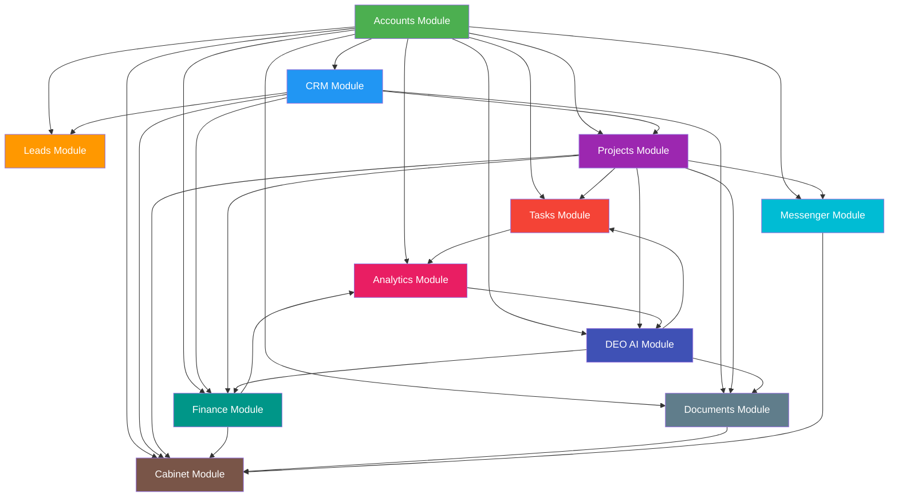

# DEO STUDIO CRM — Модульная архитектура

## 🧩 Общая схема модулей

```
┌─────────────────────────────────────────────────────────────────────────────┐
│                         DEO STUDIO CRM                                      │
│  ┌──────────────────────────────────────────────────────────────────────┐  │
│  │                        CORE MODULES                                  │  │
│  │  ┌────────────┐ ┌──────────┐ ┌──────────┐ ┌──────────┐ ┌─────────┐  │  │
│  │  │  Accounts  │ │  CRM     │ │  Leads   │ │ Projects │ │  Tasks  │  │  │
│  │  │  (Auth)    │ │ (Client) │ │ (Sales)  │ │          │ │         │  │  │
│  │  └────────────┘ └──────────┘ └──────────┘ └──────────┘ └─────────┘  │  │
│  └──────────────────────────────────────────────────────────────────────┘  │
│  ┌──────────────────────────────────────────────────────────────────────┐  │
│  │                     SERVICE MODULES                                  │  │
│  │  ┌────────────┐ ┌──────────┐ ┌──────────┐ ┌──────────┐ ┌─────────┐  │  │
│  │  │  Finance   │ │Documents │ │Messenger │ │Analytics │ │ Cabinet │  │  │
│  │  │            │ │          │ │          │ │          │ │ (Client)│  │  │
│  │  └────────────┘ └──────────┘ └──────────┘ └──────────┘ └─────────┘  │  │
│  └──────────────────────────────────────────────────────────────────────┘  │
│  ┌──────────────────────────────────────────────────────────────────────┐  │
│  │                       AI MODULE                                       │  │
│  │  ┌──────────────────────────────────────────────────────────────┐    │  │
│  │  │                    DEO AI Assistant                           │    │  │
│  │  └──────────────────────────────────────────────────────────────┘    │  │
│  └──────────────────────────────────────────────────────────────────────┘  │
└─────────────────────────────────────────────────────────────────────────────┘
```

---

## 1. Модуль Accounts (Аутентификация и роли)

### Назначение
Управление пользователями, ролями, правами доступа и аутентификацией.

### Компоненты

```
accounts/
├── models/
│   ├── User              # Кастомная модель пользователя
│   ├── Role              # Роли (superadmin, owner, pm, dev, designer, marketer, client)
│   ├── Permission        # Индивидуальные разрешения
│   ├── UserRole          # Связь пользователь-роль
│   ├── RolePermission    # Связь роль-разрешение
│   └── UserActivityLog   # Аудит действий
├── serializers/
│   ├── UserSerializer
│   ├── RegisterSerializer
│   ├── LoginSerializer
│   ├── RoleSerializer
│   └── PermissionSerializer
├── views/
│   ├── AuthViewSet       # login, logout, refresh, register
│   ├── UserViewSet       # CRUD пользователей
│   ├── RoleViewSet       # Управление ролями
│   └── PermissionViewSet
├── permissions/          # Кастомные permission classes
│   ├── IsAdmin
│   ├── IsOwner
│   ├── IsProjectManager
│   └── IsClient
├── management/commands/  # Management commands
│   ├── create_roles.py
│   └── create_superuser.py
└── signals.py            # Сигналы (создание профиля, логирование)
```

### Обработчики

| Метод | Endpoint | Роль | Описание |
|-------|----------|------|----------|
| POST | /api/auth/login/ | Public | Вход в систему |
| POST | /api/auth/register/ | Public | Регистрация |
| POST | /api/auth/refresh/ | Public | Обновление JWT |
| POST | /api/auth/logout/ | Authenticated | Выход |
| GET | /api/auth/me/ | Authenticated | Текущий пользователь |
| PATCH | /api/auth/me/ | Authenticated | Обновление профиля |
| POST | /api/auth/change-password/ | Authenticated | Смена пароля |
| POST | /api/auth/2fa/enable/ | Authenticated | Включение 2FA |
| POST | /api/auth/2fa/verify/ | Authenticated | Подтверждение 2FA |

### Зависимости
- **Ни от кого не зависит** (базовый модуль)

---

## 2. Модуль CRM (Клиенты)

### Назначение
Ведение клиентской базы с полной историей взаимодействий.

### Компоненты

```
clients/
├── models/
│   ├── Client              # Карточка клиента
│   ├── ClientTag           # Теги для клиентов
│   ├── ClientTagAssignment # Связь тегов
│   └── ClientInteraction   # История взаимодействий
├── serializers/
│   ├── ClientSerializer
│   ├── ClientListSerializer
│   ├── ClientDetailSerializer
│   └── ClientInteractionSerializer
├── views/
│   ├── ClientViewSet       # CRUD + поиск, фильтрация
│   └── ClientInteractionViewSet
├── filters.py              # Фильтры (по тегам, дате, доходу)
└── signals.py              # Сигналы при создании/изменении
```

### Зависимости
- Зависит от: **Accounts** (кто создал/ведет клиента)

---

## 3. Модуль Leads (Лиды и продажи)

### Назначение
Управление воронкой продаж и конверсией лидов.

### Компоненты

```
leads/
├── models/
│   ├── LeadStage           # Этапы воронки
│   ├── Lead                # Карточка лида
│   ├── LeadHistory         # История перемещений
│   └── LeadFile            # Файлы лида
├── serializers/
│   ├── LeadSerializer
│   ├── LeadStageSerializer
│   └── LeadKanbanSerializer  # Данные для Kanban-доски
├── views/
│   ├── LeadViewSet         # CRUD + Kanban
│   ├── LeadStageViewSet
│   ├── LeadMoveView        # Смена статуса (drag & drop)
│   └── LeadKanbanView      # Получение данных для Kanban
├── kanban.py               # Kanban board logic
└── signals.py              # Обновление воронки
```

### Зависимости
- Зависит от: **Accounts**, **CRM** (может быть привязан к существующему клиенту)

---

## 4. Модуль Projects (Проекты)

### Назначение
Управление проектами, командами и прогрессом.

### Компоненты

```
projects/
├── models/
│   ├── ProjectStatus       # Статусы проекта
│   ├── ServiceType         # Типы услуг
│   ├── Project             # Карточка проекта
│   ├── ProjectTeamMember   # Участники проекта
│   └── ProjectHistory      # История изменений
├── serializers/
│   ├── ProjectSerializer
│   ├── ProjectListSerializer
│   ├── ProjectDetailSerializer
│   └── ProjectTeamSerializer
├── views/
│   ├── ProjectViewSet      # CRUD + фильтрация по статусу
│   ├── ProjectTeamViewSet  # Управление командой
│   └── ProjectTimelineView # Gantt/таймлайн
├── gantt.py                # Генерация Gantt-диаграммы
└── signals.py              # Логирование изменений
```

### Зависимости
- Зависит от: **Accounts**, **CRM** (клиент)

---

## 5. Модуль Tasks (Задачи)

### Назначение
Управление задачами, подзадачами, тайм-трекинг.

### Компоненты

```
tasks/
├── models/
│   ├── TaskStatus          # Статусы задачи
│   ├── TaskPriority        # Приоритеты
│   ├── Task                # Задача/подзадача
│   ├── TaskAttachment      # Вложения
│   ├── TaskComment         # Комментарии
│   ├── TaskHistory         # История изменений
│   └── TaskTimer           # Таймер учета времени
├── serializers/
│   ├── TaskSerializer
│   ├── TaskListSerializer
│   ├── TaskKanbanSerializer
│   ├── TaskCommentSerializer
│   └── TaskTimerSerializer
├── views/
│   ├── TaskViewSet         # CRUD + фильтры
│   ├── TaskCommentViewSet
│   ├── TaskTimerViewSet    # Start/Stop/Pause
│   └── TaskKanbanView      # Kanban доска задач
├── filters.py              # По проекту, исполнителю, статусу
└── permissions.py          # Доступ по проекту/роли
```

### Зависимости
- Зависит от: **Accounts**, **Projects**

---

## 6. Модуль Finance (Финансы)

### Назначение
Учет финансов компании: счета, платежи, расходы, зарплаты.

### Компоненты

```
finance/
├── models/
│   ├── Invoice             # Счет
│   ├── InvoiceItem         # Позиции счета
│   ├── Payment             # Платеж
│   ├── ExpenseCategory     # Категории расходов
│   ├── Expense             # Расход
│   └── Salary              # Зарплата
├── serializers/
│   ├── InvoiceSerializer
│   ├── InvoiceCreateSerializer
│   ├── PaymentSerializer
│   ├── ExpenseSerializer
│   └── SalarySerializer
├── views/
│   ├── InvoiceViewSet      # CRUD + генерация PDF
│   ├── PaymentViewSet
│   ├── ExpenseViewSet
│   ├── SalaryViewSet
│   └── FinancialReportView # Отчеты
├── reports.py              # Генерация финансовых отчетов
└── pdf_generator.py        # Генерация PDF счетов/актов
```

### Зависимости
- Зависит от: **Accounts**, **CRM**, **Projects**

---

## 7. Модуль Documents (Документы)

### Назначение
Централизованное хранение и управление документами.

### Компоненты

```
documents/
├── models/
│   ├── DocumentType        # Типы документов
│   ├── Document            # Документ
│   └── DocumentTemplate    # Шаблоны документов
├── serializers/
│   └── DocumentSerializer
├── views/
│   ├── DocumentViewSet     # CRUD + загрузка
│   └── DocumentTemplateViewSet
├── s3_storage.py           # Загрузка в S3
└── file_validators.py      # Валидация типов/размеров файлов
```

### Зависимости
- Зависит от: **Accounts**, **CRM**, **Projects**

---

## 8. Модуль Messenger (Мессенджер)

### Назначение
Встроенный корпоративный мессенджер.

### Компоненты

```
messenger/
├── models/
│   ├── Chat                # Чат
│   ├── ChatParticipant     # Участники чата
│   ├── Message             # Сообщение
│   ├── MessageRead         # Прочтения
│   └── MessageReaction     # Реакции
├── serializers/
│   ├── ChatSerializer
│   ├── ChatListSerializer
│   ├── MessageSerializer
│   └── MessageCreateSerializer
├── views/
│   ├── ChatViewSet         # CRUD чатов
│   ├── MessageViewSet      # CRUD сообщений
│   └── UnreadCountView     # Счетчик непрочитанных
├── consumers/              # WebSocket consumers (Django Channels)
│   ├── chat_consumer.py    # WebSocket для чата
│   └── notification_consumer.py
├── routing.py              # WebSocket routing
└── tasks.py                # Celery: уведомления, FCM push
```

### Зависимости
- Зависит от: **Accounts**, **Projects** (групповые чаты проектов)

---

## 9. Модуль Analytics (Аналитика)

### Назначение
Аналитические дашборды и отчеты в реальном времени.

### Компоненты

```
analytics/
├── models/
│   ├── AnalyticsDashboard  # Дашборды
│   ├── AnalyticsMetric     # Метрики
│   └── Report              # Отчеты
├── serializers/
│   ├── DashboardSerializer
│   └── MetricSerializer
├── views/
│   ├── DashboardViewSet
│   ├── MetricViewSet       # Фильтр по дате/типу
│   └── ReportGenerateView  # Генерация отчета
├── metrics/                # Вычисление метрик
│   ├── client_metrics.py
│   ├── project_metrics.py
│   ├── finance_metrics.py
│   ├── task_metrics.py
│   └── sales_metrics.py
├── tasks.py                # Celery: периодический подсчет метрик
└── exports.py              # Экспорт в PDF/XLSX
```

### Зависимости
- Зависит от: **всех модулей** (агрегирует данные)

---

## 10. Модуль Cabinet (Клиентский кабинет)

### Назначение
Личный кабинет клиента для отслеживания проектов и документов.

### Компоненты

```
cabinet/
├── views/
│   ├── ClientProjectsView  # Список проектов клиента
│   ├── ClientTasksView     # Статусы задач
│   ├── ClientDocumentsView # Документы
│   ├── ClientInvoicesView  # Счета
│   ├── ClientPaymentsView  # История платежей
│   └── ClientMessagesView  # Переписка с менеджером
├── serializers/
│   ├── ClientDashboardSerializer
│   └── ClientProjectProgressSerializer
├── permissions.py          # Только свой клиент
└── mixins.py               # Общие методы для клиентского доступа
```

### Зависимости
- Зависит от: **Accounts**, **Projects**, **Documents**, **Finance**, **Messenger**

---

## 11. Модуль DEO AI (AI-ассистент)

### Назначение
Интеллектуальный помощник для автоматизации рутинных задач.

### Компоненты

```
ai_assistant/
├── models/
│   ├── AIPromptTemplate    # Шаблоны промптов
│   └── AIRequest           # История запросов
├── serializers/
│   ├── AIRequestSerializer
│   └── PromptTemplateSerializer
├── views/
│   ├── AIGenerateView      # Генерация контента
│   └── PromptTemplateViewSet
├── services/
│   ├── llm_client.py       # Клиент к LLM (GPT-4 / Claude)
│   ├── tz_generator.py     # Генерация ТЗ
│   ├── proposal_generator.py # Создание КП
│   ├── contract_generator.py # Договоры
│   ├── report_generator.py   # Отчеты
│   ├── summary_generator.py  # Суммаризация
│   └── estimate_generator.py # Оценка стоимости
├── templates/              # Промпт-шаблоны
│   ├── tz_template.json
│   ├── commercial_offer_template.json
│   ├── contract_template.json
│   └── report_template.json
└── tasks.py                # Celery: асинхронная генерация
```

### Зависимости
- Зависит от: **Accounts**, **Projects**, **Finance**

---

## 📊 Диаграмма зависимостей модулей



---

## 🔧 Определение первого релиза (MVP)

### MVP (Core Features)

| Модуль | Функции |
|--------|---------|
| **Accounts** | ✅ Регистрация, логин, JWT, роли (3: admin, pm, client) |
| **CRM** | ✅ CRUD клиентов, поиск, фильтрация |
| **Leads** | ✅ Kanban-доска, 5 базовых этапов |
| **Projects** | ✅ CRUD проектов, статусы, команда |
| **Tasks** | ✅ CRUD задач, статусы, комментарии, назначение |
| **Client Cabinet** | ✅ Просмотр проектов, задач, документов |

### Релиз 2

| Модуль | Функции |
|--------|---------|
| **Finance** | ✅ Счета, платежи, базовые расходы |
| **Documents** | ✅ Загрузка, хранение, привязка к проектам |
| **Analytics** | ✅ Базовый дашборд, 5 ключевых метрик |

### Релиз 3

| Модуль | Функции |
|--------|---------|
| **Messenger** | ✅ Чаты, сообщения, файлы, WebSocket |
| **Finance** | ✅ Зарплаты, расширенные отчеты |
| **DEO AI** | ✅ Генерация ТЗ и КП |

### Релиз 4 (Full Feature)

| Модуль | Функции |
|--------|---------|
| **All** | Полный функционал, оптимизация, интеграции |
| **Mobile** | Flutter приложение |
